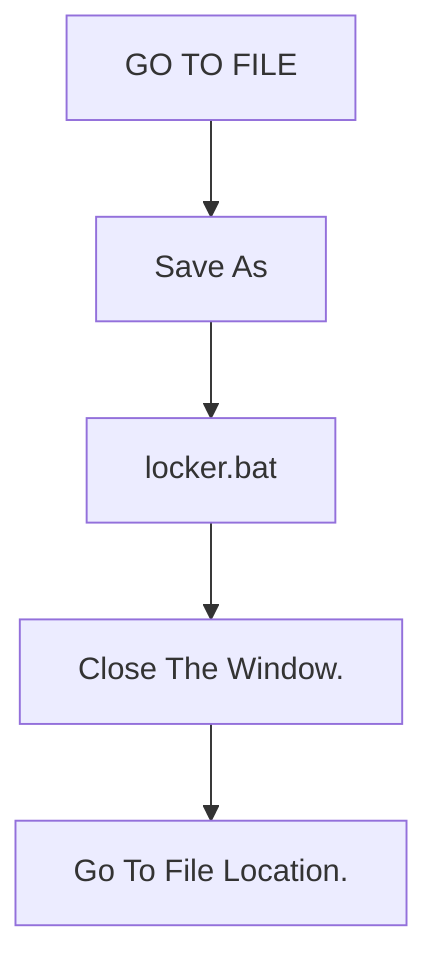

# FILE PROTECTION

File protection is bash scripting used to secure your files and folders.<br/>

NOTE:
```bash
Default Password: YOUR-PASSWORD
```

## Installation

Use this command in cmd [mkdir](https://www.computerhope.com/issues/ch000742.htm) to create a file inside a folder.
```bash
Press "win+r" and type "cmd", Press enter.
```
```bash
cd [Folder Name]/
```
```bash
notepad locker.txt
```
```bash
Select "yes" from the dialog box.
```

Copy paste the below code in notepad.

```bash
@ECHO OFF
if EXIST "Control Panel.{21EC2020-3AEA-1069-A2DD-08002B30309D}" goto UNLOCK
if NOT EXIST Private goto MDPrivate
:CONFIRM
echo Are you sure to lock this folder? (Y/N)
set/p "cho=>"
if %cho%==Y goto LOCK
if %cho%==y goto LOCK
if %cho%==n goto END
if %cho%==N goto END
echo Invalid choice.
goto CONFIRM
:LOCK
ren Private "Control Panel.{21EC2020-3AEA-1069-A2DD-08002B30309D}"
attrib +h +s "Control Panel.{21EC2020-3AEA-1069-A2DD-08002B30309D}"
echo Folder locked
goto End
:UNLOCK
echo Enter password to Unlock Your Secure Folder
set/p "pass=>"
if NOT %pass%== YOUR-PASSWORD goto FAIL
attrib -h -s "Control Panel.{21EC2020-3AEA-1069-A2DD-08002B30309D}"
ren "Control Panel.{21EC2020-3AEA-1069-A2DD-08002B30309D}" Private
echo Folder Unlocked successfully
goto End
:FAIL
echo Invalid password
goto end
:MDPrivate
md Private
echo Private created successfully
goto End
:End
```
```bash
If U Want to set ur own password go to line no 21 and change from 'YOUR-PASSWORD' to 'NEW PASSWORD'.
```
## How to Convert .txt to .bat

```bash
Double Tap on the locker.bat file
```
```bash
Now you Can able to see a new Directory "Private".
```
```bash
Select the required files and move them to the private directory.
```
```bash
Come back to the previous window and double-tap the locker.bat
```
```bash
You will display with pop-up cmd(command prompt) press capital "Y" to lock and press enter.
```
```bash
After you will no able to see the private directory which is hidden.
```
## IDecryption
```bash
To see the private directory again double-tap on the .bat file.
```
```bash
The command prompt window will be opened.
```
```bash
Enter your password and press enter.
```
```bash
Now you can access your directory.
```


## Contributing
Pull requests are welcome. For significant changes, please open an issue to discuss what you would like to change.

Please make sure to update tests as appropriate

## License
NARENDRAHACKZ
<div id="badges">
  <a href="https://www.linkedin.com/in/karri-narendra-reddy-4bb72318a/">
    
  </a>
  <a href="https://www.instagram.com/narendrahackz/">
    
  </a>
  <a href="https://twitter.com/NarendraHackz">
    
  </a>
  <a href="http://wa.me/919676783345">
    
  </a>
</div>

